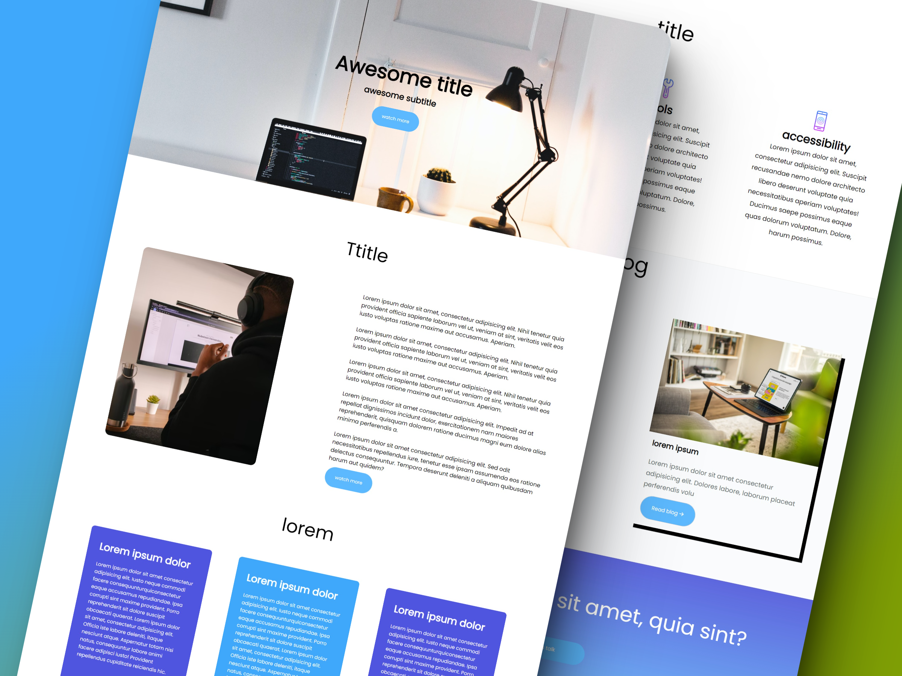

#  Landing page courses 📑
 ## Introduction
&#x27AB; Welcome to my frist personal project. This is a landing page for a courses website. The main goal of this project is to practice my HTML and CSS skills. I also wanted to learn how to use Flexbox. I used Flexbox to create the layout of the page. I also used CSS Grid to create the layout of the footer. I used the BEM methodology to name my classes. 

## Technologies

* HTML
* CSS

  
  
  
  
 

## Features
* Clean and modern design
* Clear and concise text

# Design

  

## Resourses

* [Google Fonts](https://fonts.google.com/)
* [Font Awesome](https://fontawesome.com/)
* [Unsplash](https://unsplash.com/)
